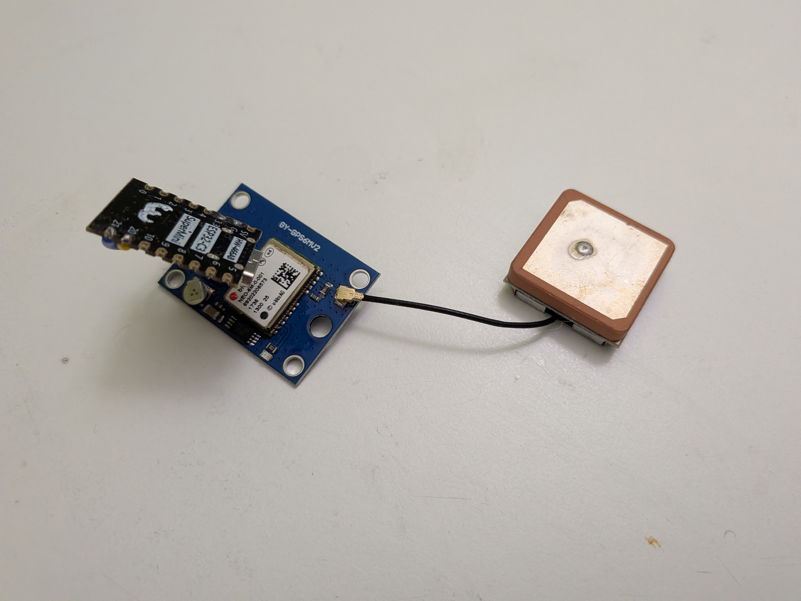
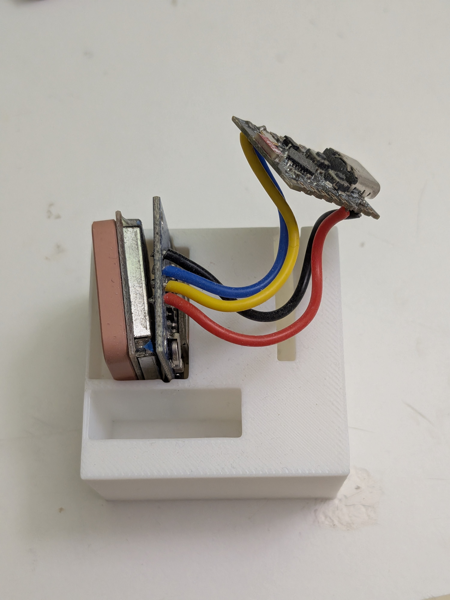
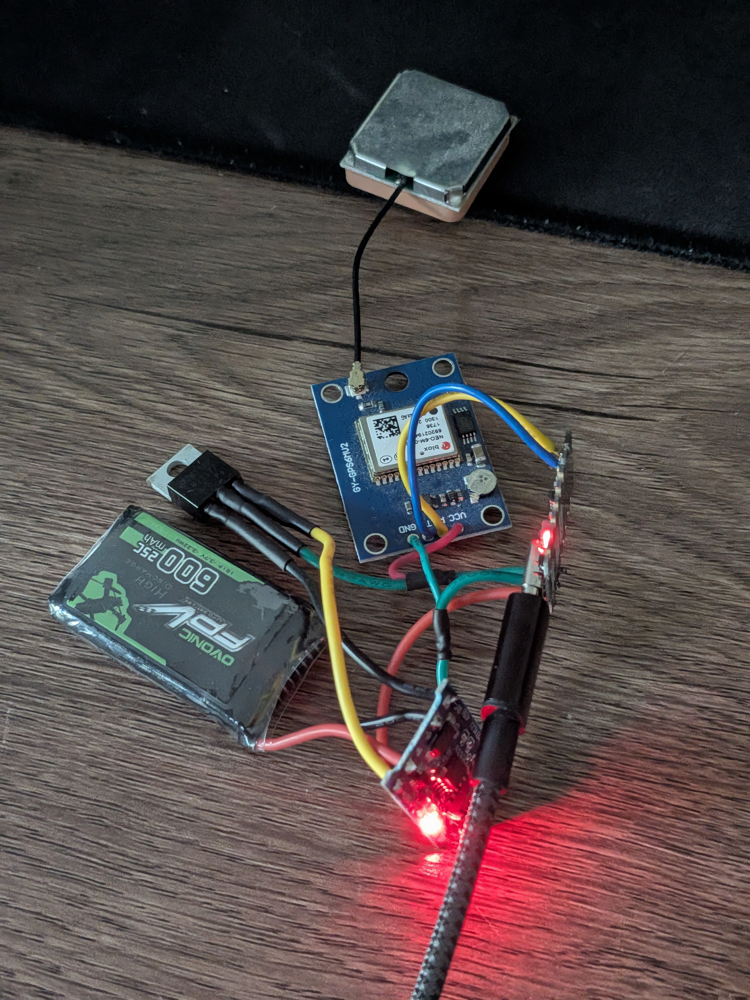
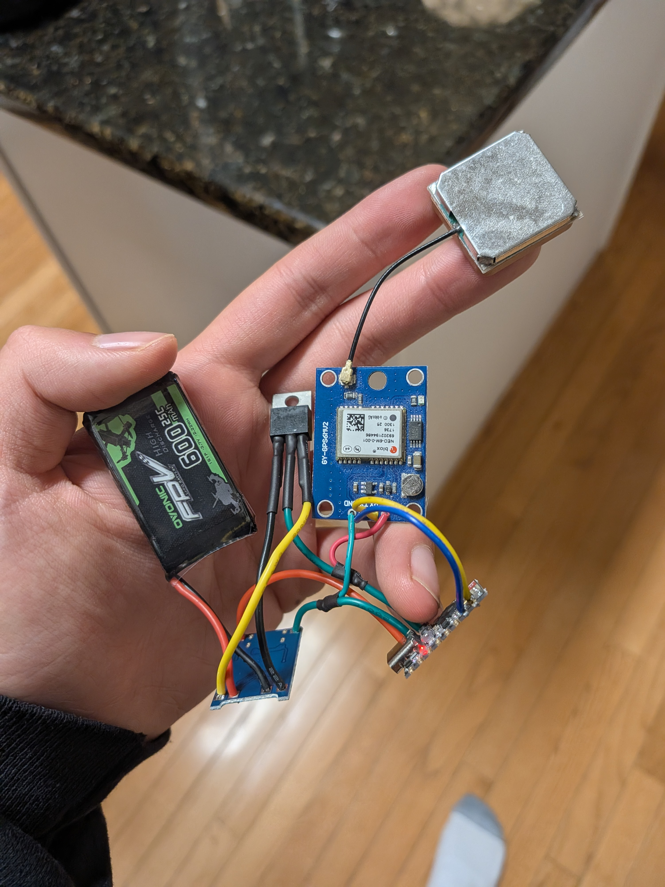

# esp-gps
An esp32 gps module interfacing project, intended for cross-country (XC) run tracking.
## hardware
- esp32 (c3 supermini)
- neo-6m gps module with active antenna
- 3.7v lipo battery (600mAh+)
- LM1117 linear low-dropout (LDO) voltage regulator (3.7v, up to 250mA)
- wires

### tools 
- 3d printer
- soldering iron
- computer w/ usb serial

## software
- all software is included in the project (more documentation soon)
- poorly developed!

# Updates
4/21

